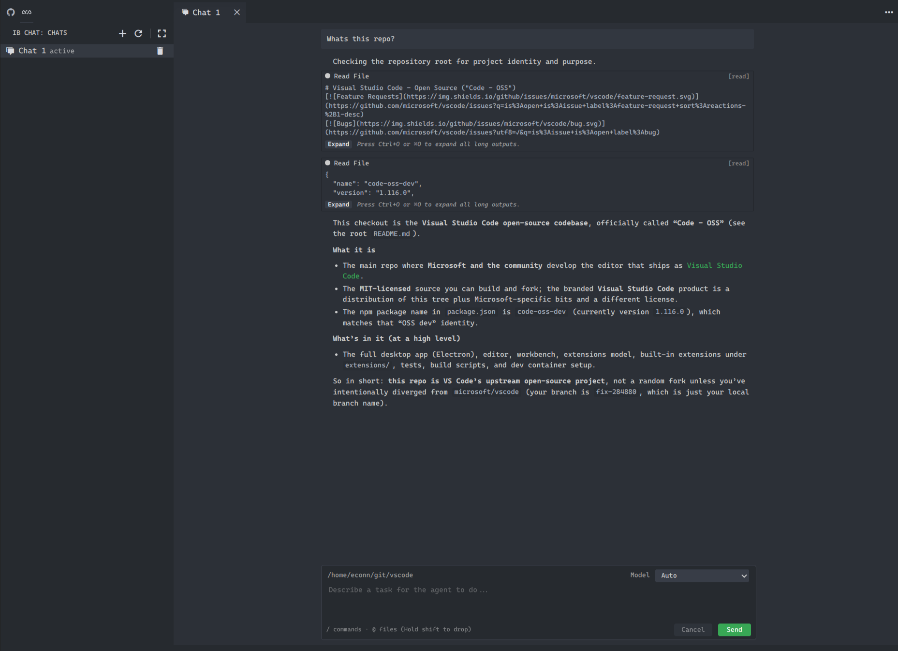

# ACP UI

VS Code extension that brings an **ACP UI** panel to the [Agent Client Protocol (ACP)](https://github.com/agentclientprotocol) — chat with configured agent processes from the editor.

Open **ACP UI** from the activity bar to get a dedicated chat surface next to your code: the **Chats** view lists sessions, and the webview shows the running conversation with the same UI in an editor tab or side panel.



*Activity bar entry, Chats sidebar, and ACP UI webview in one layout.*

## Features

- **ACP UI** webview: ACP-backed chat in an editor tab or panel (see above). The composer and quick actions live along the bottom of the panel:

  

  *Prompt field, attachments, and controls at the foot of ACP UI.*

- **Chats** sidebar under the **ACP UI** activity bar: list sessions, open, refresh, delete.
- **Agent picker**: choose which configured agent backs the current chat (agents come from `ib-acp-ui.agents`):

  

  *Selecting among configured agents in the chat UI.*

- **ACP UI RPC** output channel for debugging protocol traffic.
- **Agent configuration** via `ib-acp-ui.agents` in settings (command, args, env per agent).

## Usage

1. Install the extension and open the **ACP UI** view in the activity bar.
2. Use **Open ACP UI** (or **New ACP UI in Editor** from the Chats view) to start a session.
3. Adjust agents under **Settings → Extensions → ACP UI** (`ib-acp-ui.agents`).
4. Use composer slash commands documented in [`BUILTIN_COMMANDS.md`](BUILTIN_COMMANDS.md).

## Development

```bash
npm ci
npm run build      # webview + extension bundle
npm run watch      # extension esbuild watch (run build:webview first or after UI changes)
npm run check      # TypeScript
npm run test       # vitest
npm run verify     # build + check + test + lint
```

For a browser-only UI loop without VS Code, use `npm run dev:standalone` (see `standalone/`).

Publishing is automated when `package.json` **version** changes on `main` (see `.github/workflows/publish.yml`).

## Explore

| Area | Role |
| --- | --- |
| [`src/extension.ts`](src/extension.ts) | Extension entry: activates ACP services, ACP UI panel, Chats tree view. |
| [`src/extension/`](src/extension/) | Chat webview registration, sessions sidebar, agent picker, prompt history. |
| [`src/acp/`](src/acp/) | ACP session bridge, agent config from VS Code settings, RPC helpers. |
| [`src/protocol/`](src/protocol/) | Messages between extension host and webview. |
| [`webview/acp-ui/`](webview/acp-ui/) | React + Vite webview UI (chat UI, markdown, state). |
| [`standalone/`](standalone/) | Local dev server and mocks for the webview without the extension host. |
| [`specs/`](specs/) | Design notes for features and commands. |
| [`media/`](media/) | Activity bar and view icons. |

For standalone model seeding from captured ACP logs, see [`src/acp/session/readmeSessionModels.ts`](src/acp/session/readmeSessionModels.ts) and `standalone/mock/readme.ndjson`.

## License

MIT — see [`package.json`](package.json) `license` field.
